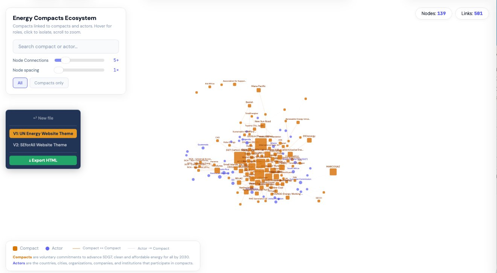
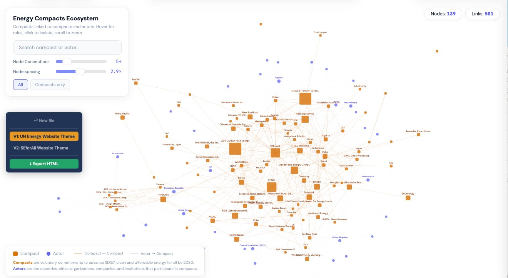
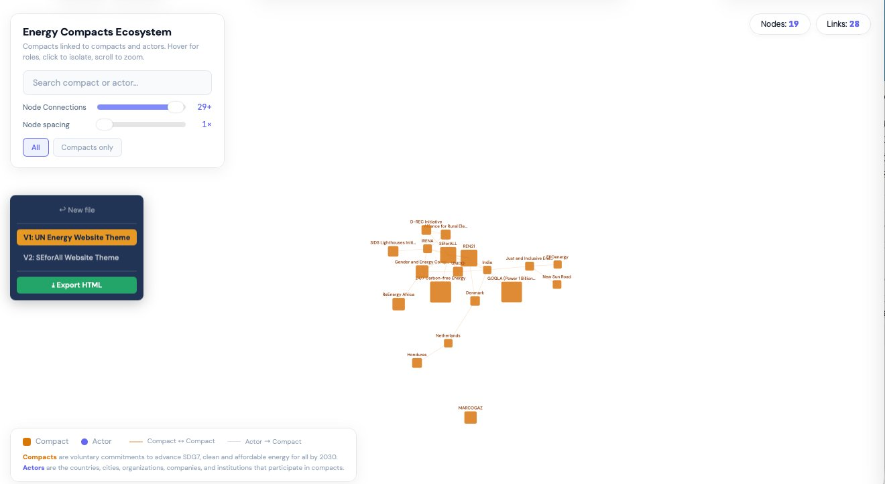
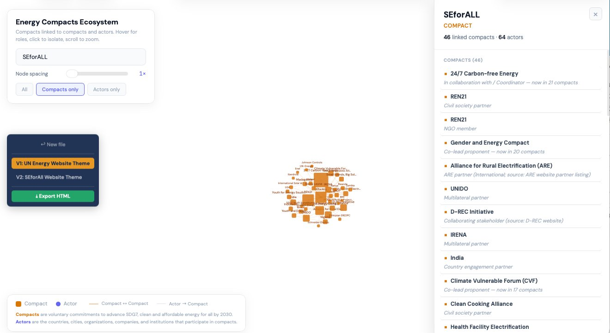
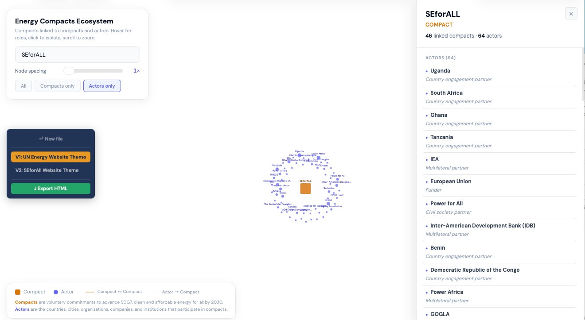
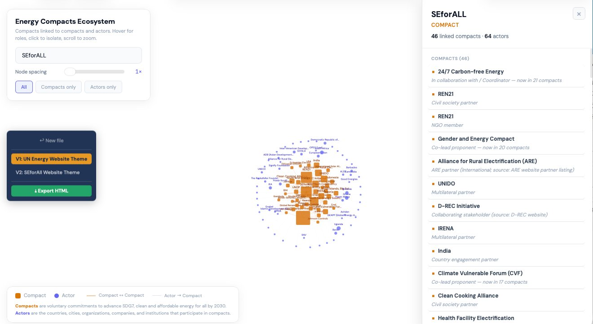
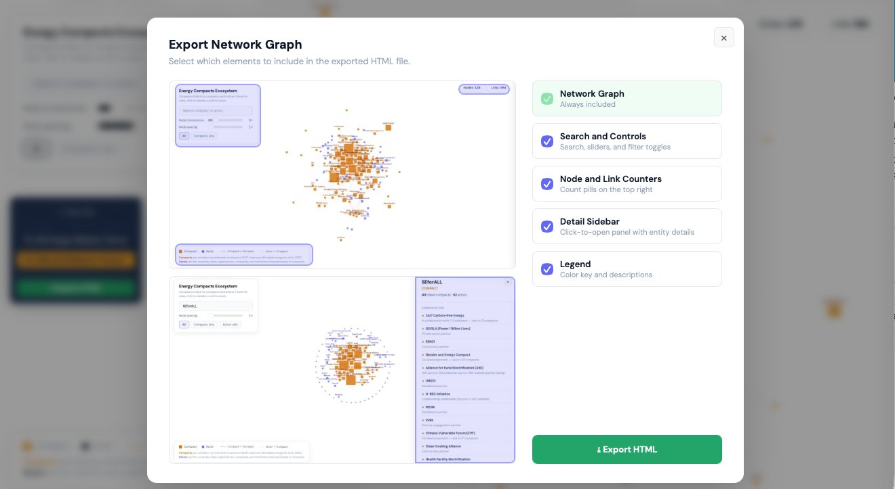

# Energy Compacts Ecosystem Network Graph

An interactive network visualization tool for exploring the relationships between Energy Compacts and their participating Actors within the UN Energy Compacts framework.

## Demo

https://github.com/Parhamzn/SEforAll/raw/main/Network%20Graph/network_graph_demo.mp4

<video src="https://github.com/Parhamzn/SEforAll/raw/main/Network%20Graph/network_graph_demo.mp4" controls width="100%"></video>

## Overview

This tool takes a structured CSV or Excel database of compact-actor relationships and generates a force-directed network graph where compacts and actors are represented as nodes, and their relationships as links. Users can explore the ecosystem by searching, filtering, clicking to isolate entities, and examining detailed connection information through an interactive sidebar.

## Getting Started

1. Open `Graph_Network_Interactive.html` in any modern web browser (Chrome, Firefox, Safari, Edge).
2. Upload the `compact_actor_database` file (CSV or Excel) by dragging it onto the drop zone or clicking to browse.
3. Review the parsed data summary (compact count, actor count, connections).
4. Click **Launch Network Graph** to generate the visualization.



## Input Data Format

The tool expects a CSV or Excel file (.xlsx) with five columns:

| Column | Description | Example |
|--------|-------------|---------|
| **Compact** | Name of the Energy Compact | `SEforALL` |
| **Compact ID** | Unique identifier for the compact | `08001V1` |
| **Actor** | Name of the participating actor | `IRENA` |
| **Actor ID** | Unique identifier for the actor | `A001` |
| **Role** | The actor's role in the compact | `Lead proponent` |

Each row represents one actor-compact relationship. A compact can have many actors, and an actor can participate in multiple compacts.

### How Entities Are Joined

Nodes are keyed by their **ID** columns (`Compact ID`, `Actor ID`), not by their display names. This means:

- If the same compact appears across multiple rows with slightly different spellings (e.g. `RELAC` in one row and `Renewables in Latin America and the Caribbean (RELAC)` in another), as long as they share the same `Compact ID` they are merged into one node.
- The first display name encountered for a given ID becomes the node label.
- If an `ID` cell is missing, the tool falls back to the entity's normalized name (lowercased + trimmed) as the join key — so plain CSV files without IDs still work.

### Actor-as-Compact Logic

The tool automatically detects when an actor's name matches a compact's name (e.g., "Brazil" appears as both a compact and an actor in other compacts). The match is **case-insensitive and whitespace-tolerant** — `UNIDO`, `Unido`, and `UNIDO ` are all recognized as the same entity. When promoted, these actors become compact-typed nodes, creating compact-to-compact links that reveal cross-compact relationships.

## Features

### Network Graph
- Force-directed layout using D3.js with physics simulation
- Compacts shown as amber/gold squares, actors as colored circles
- Edge thickness and color distinguish compact-compact links from actor-compact links
- Zoom (scroll) and pan (drag background) navigation
- Auto-fit to viewport on load
- Auto-pan-back when the graph's centroid drifts outside the viewport



### Search and Controls
- **Search bar**: Find any compact or actor by name (substring, case-insensitive, 250 ms debounced)
- **Node Connections slider**: Filter nodes by minimum total connection count (0 to 30, 150 ms debounced). Uses the same total-degree definition for both compacts and actors.
- **Node Spacing slider**: Spread nodes apart for readability (1x to 5x)
- **Filter toggles**: Show All, Compacts only, or Actors only (contextual)



The "Compacts only" toggle hides actor nodes while keeping compact-compact relationships visible. "Actors only" does the inverse — useful when an entity is selected and you want to see only its peer compacts or only its participating actors.





### Click-to-Isolate
- Click any node to isolate it and show only its direct connections
- The graph rebuilds to focus on the selected entity's neighborhood
- Click again or click the background to return to the full graph

### Detail Sidebar
- Opens when a node is clicked, showing entity name, type, and connection counts
- Lists all connected compacts and actors with their roles
- Sidebar items are clickable for chain navigation through the network
- Hover effects indicate interactivity



### Theme Switching
- **V1: UN Energy Website Theme**: Amber compacts, indigo actors, white background
- **V2: SEforAll Website Theme**: Gold compacts, dark blue actors, white background

### Export
- Click **Export HTML** to open the export panel
- Select which UI elements to include (controls, stats, sidebar, legend)
- The network graph is always included
- Generates a standalone HTML file with embedded data and full interactivity
- Preview images show which elements correspond to each checkbox



## Technical Details

- Built with D3.js v7.9.0 for force simulation and SVG rendering
- SheetJS (xlsx.js v0.18.5) for client-side CSV and Excel parsing
- Both CDN scripts are loaded with **Subresource Integrity (SRI)** hashes — the browser will refuse to execute the dependencies if their contents have been tampered with
- User-supplied names and roles are HTML-escaped before being inserted into the sidebar and tooltips, preventing XSS from malicious or accidentally-crafted spreadsheet data
- All processing happens locally in the browser; no server required
- Exported files are fully self-contained single-file HTML documents named `Graph_Network_<theme>.html`

## File Structure

```
Graph_Network_Interactive.html   - Main interactive tool (upload + graph + export)
Graph_Network_<theme>.html       - Exported standalone graph (generated on demand by the Export HTML button)
compact_actor_database.xlsx      - Source data (170 compact rows, 1,379 actor labels, 2,147 raw relationships)
Graph_Network_README.md          - This file
Graph_Network_User_Guide.pdf     - Detailed user guide with screenshots
```

## Browser Compatibility

Tested and supported on:
- Google Chrome 90+
- Mozilla Firefox 88+
- Safari 14+
- Microsoft Edge 90+

## Data Summary

After ID-based de-duplication and case-insensitive name normalization, the current dataset resolves to:

- **169** unique Energy Compacts
- **1,204** unique Actors (countries, organizations, companies, institutions)
- **2,067** actor-compact relationships
- **94** actors that share names with compacts (promoted to compact-typed nodes)
- **1,021** unique role descriptions

(Raw spreadsheet contains 2,147 rows with 170 distinct compact name spellings and 1,379 distinct actor name spellings — the ID-based join collapses spelling variants of the same entity. For example, `RELAC` and `Renewables in Latin America and the Caribbean (RELAC)` both share Compact ID `04002V1` and are merged.)
